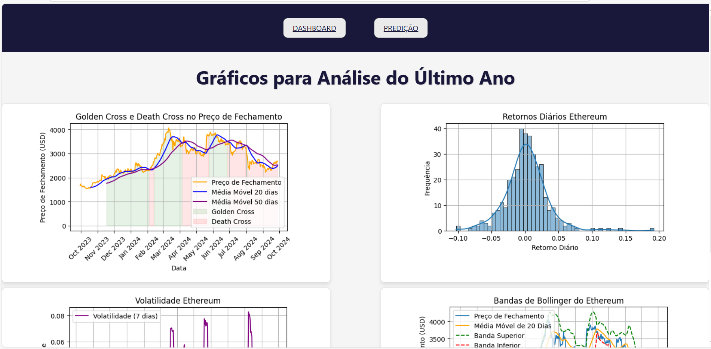
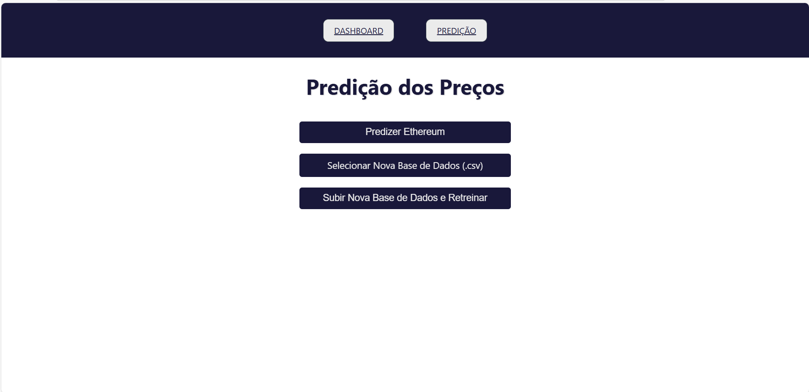

# Ponderada Cripto
Sistema de auxílio à tomada de decisões para investimento em cripto ativos

## Funcionalidades
- Previsão dos preços do Ethereum utilizando diferentes modelos (GRU, ARIMA, Holt-Winters, Random Forest).
- Upload de novos datasets CSV para retreino dos modelos.
- Interface web para visualização das previsões e gráficos comparativos.
- Recomendação sobre a compra de Ethereum com base nas previsões.

## Estrutura do Projeto

PONDERADA-CRIPTO/
│
├── backend/
│   ├── dados/                    
│   ├── logs/                     
│   ├── uploaded_data/            
│   ├── main.py                   
│   ├── modelos.py              
│   ├── requirements.txt
│   └── Dockerfile         
│
├── frontend/
│   ├── src/                      
│   ├── public/                   
│   ├── package.json              
│   └── Dockerfile              
│
├── docker-compose.yml            
└── README.md                      

- `backend`: API usando FastAPI
- `frontend`: Aplicação React responsável pela interface web
- `uploaded_data`: Pasta para salvar os datasets enviados pelo usuário
- `logs`: Onde os logs das operações da API são armazenados
- `Dockerfile`: Arquivo de configuração para containerização da aplicação backend.
- `docker-compose.yml`: Arquivo de configuração para rodar tanto o backend quanto o frontend em containers.

## Requisitos

Antes de rodar o projeto, instale:

- [Python 3.8+](https://www.python.org/downloads/)
- [Node.js](https://nodejs.org/)
- [Docker](https://www.docker.com/products/docker-desktop)
- [Docker Compose](https://docs.docker.com/compose/install/)

## Executar o Projeto (Docker)
- Instalar Docker
- No terminal insira os seguintes comandos:
    - `docker-compose build`
    - `docker-compose up`

## Executar o Projeto (Localmente)
Para rodar o backend, em um primeiro terminal execute:
- `venv\Scripts\activate` (Windows)
- `pip install -r requirements.txt`
- `uvicorn src.backend.main:app --reload`
Para rodar o frontend, no segundo terminal execute os seguintes comandos no diretório '/frontend'
- `npm install`
- `npm start`

## Inteface Web

## Escolha dos Modelos
### Funcionamento da Previsão
- **GRU**: Redes neurais recorrentes para séries temporais.
- **ARIMA**: Previsão baseada em autoregressão e médias móveis.
- **Holt-Winters**: Modelo para tendências e sazonalidades.
- **Random Forest Classifier**: Classificação da direção dos preços com base em variáveis técnicas.

### Justificativa
A escolha dos modelos GRU, ARIMA, Holt-Winters e Random Forest Classifier foi baseada nas suas diferentes capacidades de capturar padrões de comportamento em séries temporais financeiras.
- **GRU**: Eficaz em capturar dependências de longo prazo em dados sequenciais, ideal para prever tendências contínuas nos preços diários de Ethereum.
- **ARIMA**: Simples e eficiente para prever flutuações de curto prazo com base em padrões passados,ajudando a capturar variações históricas de preços de forma eficiente.
- **Holt-Winters**: Captura tendências e sazonalidades, características frequentes no mercado de criptomoedas, sendo ideal para prever padrões cíclicos e sazonais nos preços.
- **Random Forest Classifier**: Preve a direção dos preços (subida ou descida) com base em variáveis técnicas, robusto contra overfitting.

## Por que Data Lake não foi utilizado
O Data Lake não foi utilizado nesta ponderda porque os dados eram estruturados e vieram de uma única fonte, de uma API que passou para um banco de dados relacional PostgreSQL. Não houve necessidade de gerenciar grandes volumes de dados não estruturados, característica comum de soluções que utilizam Data Lake. A escolha pelo PostgreSQL, por conta da simplicidade e eficiência, combinada com a arquitetura de microsserviços utilizando Docker, foi suficiente para atender às necessidades de processamento e armazenamento da aplicação.

## Microsserviço (Docker)

O Docker foi utilizado para criar um ambiente padronizado e escalável, permitindo rodar o backend (FastAPI) e o frontend (React) de forma consistente em diferentes ambientes. O projeto foi dividido em dois microsserviços (frontend e backend), cada um rodando em seu próprio container, com o 'docker-compose.yml' gerenciando a comunicação entre eles.

### Backend (FastAPI)
O backend foi desenvolvido em FastAPI e é responsável por processar os dados, executar os modelos preditivos e expor uma API REST para o frontend.
- **Porta**: O backend roda na porta 8000 `http://localhost:8000`

### Frontend (React)
O frontend foi desenvolvido com React e consome a API do backend para exibir as previsões e recomendações ao usuário final.
- **Porta**: O frontend roda na porta 3000 `http://localhost:3000`

### Como Funciona 

Usar o Docker proporciona padronização, escalabilidade e portabilidade.

- **Padronização e Escalabilidade**: O Docker garante que tanto o backend quanto o frontend rodem em containers isolados, mantendo a consistência do ambiente em diferentes sistemas e facilitando o processo de deploy.

- **Facilidade de Configuração**: Ambos os serviços são configurados e iniciados com um único comando. Todas as dependências e configurações são encapsuladas nos containers, evitando instalações manuais e possíveis problemas de compatibilidade.

- **Portabilidade**: Através do Docker Compose, ambos os serviços são iniciados com um único comando, garantindo que todas as dependências estejam configuradas corretamente sem a necessidade de instalações manuais.

Os Dockerfiles foram configurados para instalar as dependências do backend e frontend, garantindo compatibilidade entre ambos. O backend, conectado ao PostgreSQL, processa previsões, enquanto o frontend consome as APIs para exibir os resultados. 
